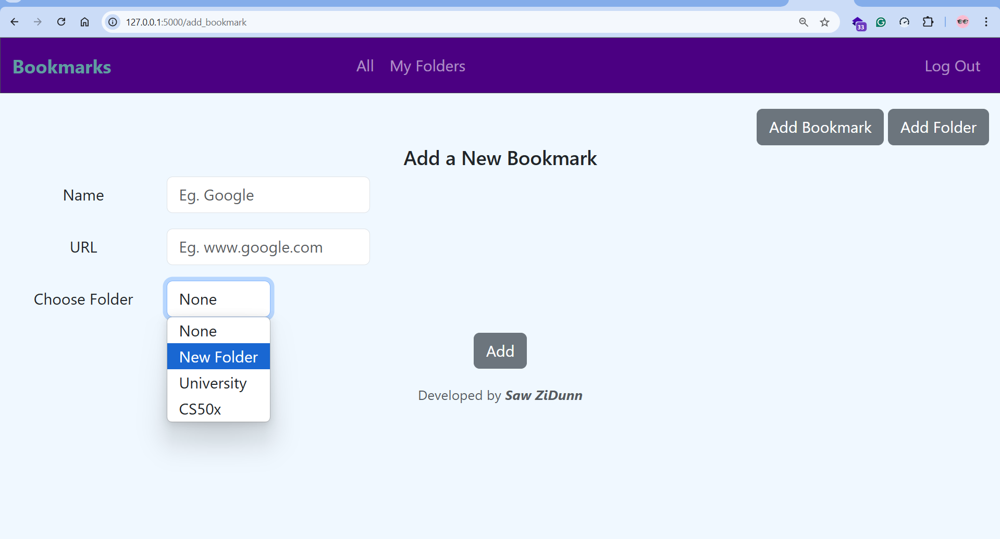
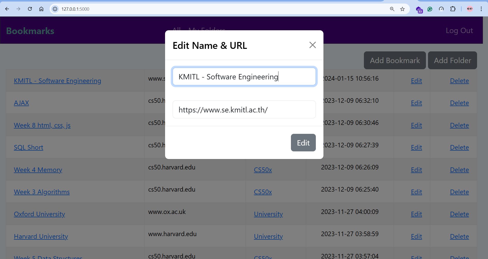

# Bookmarks

### Video Demo: <https://youtu.be/9I35fvPIIZw?si=C1WsBtnsjEKGWKeS>

### Description:

Bookmarks is a Flask-based web application for saving and organizing links into folders. Built with Flask, SQLite, HTML, CSS, and Bootstrap, it offers the following features:

-   User Authentication: Create an account to log in.
-   Organized Structure: Add, edit, and delete folders and bookmarks.
-   Folder Management:
    Save bookmarks in new or existing folders, or leave them ungrouped.
    Empty folders can be added via the "Add Folder" button.
-   Sorting & Display:
    Bookmarks and folders are displayed in descending order of creation.
    Clicking a folder name filters its bookmarks.
    Ungrouped bookmarks ("None") are excluded from "My Folders."
-   Clean Link Display: URLs are displayed as their base links (e.g., https://www.google.com → www.google.com).
-   Editing & Deletion:
    Update bookmark names/URLs and folder names.
    Deleting a folder removes its bookmarks.
-   Error Handling: Prevents user errors like empty fields, mismatched passwords, or duplicate usernames.

### Objective:

This web application lets you save your favorite websites in organized folders by creating an account. Your data is securely stored in a database, allowing you to access and visit your saved websites with a single click anytime.

### Screenshots:





### Database Schemas

```sql
CREATE TABLE bookmarks (
id INTEGER PRIMARY KEY AUTOINCREMENT NOT NULL,
name TEXT NOT NULL,
url TEXT NOT NULL,
folder_id INTEGER DEFAULT NULL,
user_id INTEGER NOT NULL,
time DATETIME NOT NULL,
FOREIGN KEY (folder_id) REFERENCES folders(id),
FOREIGN KEY (user_id) REFERENCES users(id)
);

CREATE TABLE folders ( id INTEGER PRIMARY KEY AUTOINCREMENT,
user_id INTEGER NOT NULL,
name TEXT NOT NULL,
time DATETIME NOT NULL,
FOREIGN KEY (user_id) REFERENCES users(id)
);

CREATE TABLE users (id INTEGER PRIMARY KEY AUTOINCREMENT NOT NULL, username TEXT NOT NULL, hash TEXT NOT NULL);
CREATE UNIQUE INDEX username ON users (username);
```

## Installation

1. Clone the repository:

```
$ git clone https://github.com/SawZiDunn/Bookmarks.git
```

2. Navigate to the project directory:

```
$ cd Bookmarks
```

3. Install the required libraries:

```
$ pip install -r requirements.txt
```

### Libraries

1. flask
2. cs50
3. requests
4. werkzeug
5. pytz
6. DateTime

## Usage

To run the application, navigate to the project directory and use one of the following commands:

1. With Flask:

```
$ flask run
```

2. Or with Python directly:

```
$ python app.py
```

Both commands will start the application locally.

## Contribution

I welcome suggestions and contributions to improve this web application.
